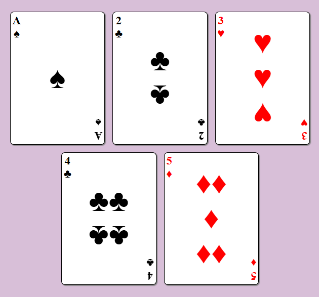

# Build a Page of Playing Cards

## Intructions

Build an app that is functionally similar to this example project:

**Objective**: Fulfill the user stories below and get all the tests to pass to complete the lab.

### User Stories:

1. You should build a webpage that displays at least three playing cards.
2. You should have a main element with an ID of playing-cards.
3. Within your #playing-cards element, you should have at least three div elements, each with a class of card.
4. Within each .card element, you should have three div elements, the first with a class of left, the second with a class of middle, and the third with a class of right.
5. Your #playing-cards element should use flexbox to horizontally center its children, allow them to wrap, and put a 20px space between them.
6. Each of your .card elements should use flexbox to justify its children using space-between.
7. Each of your .left elements should use flexbox item properties to align itself at the start of its' parent container.
8. Each of your .middle elements should use flexbox item properties to align itself in the center of its' parent container.
9. Each of your .right elements should use flexbox item properties to align itself at the end of its parent container.
10. Each of your .middle elements should use flexbox to display its children in a column.

Here are some characters you can copy and paste to use in your cards if you want: ♠, ♣, ♥, and ♦.

