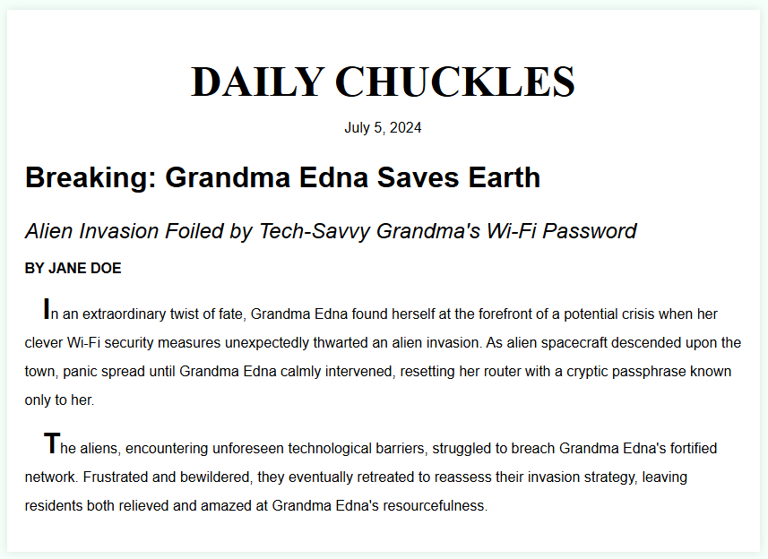

# Build a Newspaper Article

Build an app that is functionally similar to this example project:

**Objective**: Fulfill the user stories below and get all the tests to pass to complete the lab.

## User Stories:

1. You should set the root font-size of your HTML document to 24px.
2. You should have an element with a class of newspaper that contains all your other elements.
3. Your .newspaper element should have a font-size of 16px and a font of Open Sans with a fallback font of sans-serif.
4. Within your .newspaper element, you should have at least seven more elements: one for the newspaper name that has a class of name, one for the date of the article with a class of date, one for the headline with a class of headline, one for the sub-headline with a class of sub-headline, one for the author with a class of author, and two paragraphs each with a class of text. All of these elements should be filled with your article information.
5. Your .name element should have a font-size that is twice the root element's font-size and should use the Times New Roman font, with a fallback font of serif.
6. Your .name and .author elements should use CSS to make all their characters uppercase.
7. Your .headline element should have a font-size that is twice its parent element's font-size and should be bold.
8. Your .sub-headline element should have a font-weight of 100, a font-size that is 1.5 times its parent element's font-size, and should be italicized.
9. Your .author should use CSS to make it bold.
10. Your .text elements should have a text-indent of 20px.
11. Your .text elements should have a line-height that is twice their parent element's font-size.
12. The first letter of your .text elements should be bold and twice the size of their parent element's font-size. Use the ::first-letter selector for this.